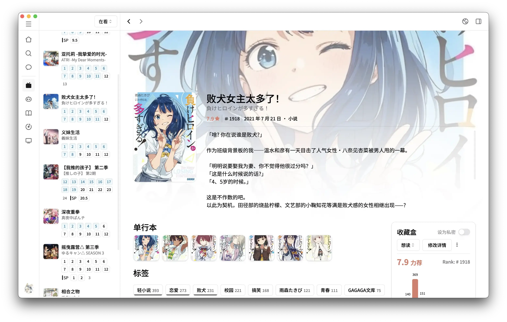

  

icon is from <a href='https://next.bgm.tv'>next.bgm.tv</a>

## 这是什么？

这是一个 [bgm.tv](https://bgm.tv) 的桌面客户端，目标是做一个好看又好用的收藏整理工具，包括但不限于动画、游戏、电视剧、音乐、图书的进度管理。

它基于 Electron-vite 和 React。

它可能不仅仅是一个 bangumi 客户端，因为我后续可能会支持收藏 bangumi 以外的东西，比如你的 figures。

## 进度？

说实话前端学习了不足一年就准备开发这个对我来说有比较大的挑战，所以在不断的踩坑和摸索。但这并不意味着要挖坑不填，因为想让大家用上它，所以我会尽最大努力去烹饪🍳。

目前在用 Logseq 做本地进度管理，后续可能会开一个 Project 或者使用 Linear 来管理总体的开发进度。

作为桌面客户端，我想要保证有以下特性：

- 快捷键
- 右键菜单
- 全局 command menu

### 所以说什么时候会有第一版

预估 24 年年底 ~~当然预估总是不准的~~

## 如果可以帮助的话

非常欢迎，由于我也摸索，同时也在参考 [AFFiNE](https://github.com/toeverything/AFFiNE) 和 [Follow](https://github.com/RSSNext/Follow) 以及其他一些优秀的 Web + Electron 项目，如果你有任何的建议（无论是功能还是代码结构问题），可以到[讨论区](https://github.com/CottonCandyZ/bangumi-electron/discussions)讨论。

### 使用了哪些常见库

Framer Motion, React/TanStack Query, Jotai, shadcn/ui, Tailwind

## Preview

虽然截图都是 Mac 的，但是也是支持 Windows 的，其实大部分时间都是在 PC 上开发的

### 怎么全都是一个页面？所以说别的页面呢

主页开发了一半被我搁置了，我正在准备将其改成那种 [drag and drop](https://swapy.tahazsh.com/) 的样式，所以正在制作中。至于原来的主页，是用 Pop Card + Carousel 的方案，有点类似微软商店，如果感兴趣的话，在 [这里的](https://home.nanachi.moe/posts/2024-08-12-global-hover-card) 的第一个视频实际有所展现。

搜索页正在制作中，由于 item-card 的样式还没有确定，以及 filter 摆放的位置问题，所以 ui 相对简陋，以及我还在考虑放出 Tags 的合理性，所以样式并不是确定的，但是还是可以预览一下的（最终可能不长这样）：

## Thanks

这个项目的存在离不开下面项目的帮助！

- [由 @cyz0729 开发的 Bangumi RN 客户端](https://github.com/czy0729/Bangumi)

- [Bangumi 自身的开源设施](https://github.com/bangumi)

- 一些组件设计和文件结构值得参考 [AFFiNE](https://github.com/toeverything/AFFiNE)

- Electron 部分的文件组织 [Follow](https://github.com/RSSNext/Follow)
